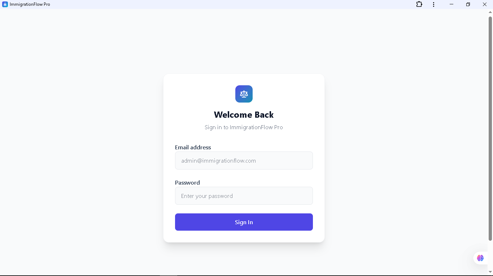
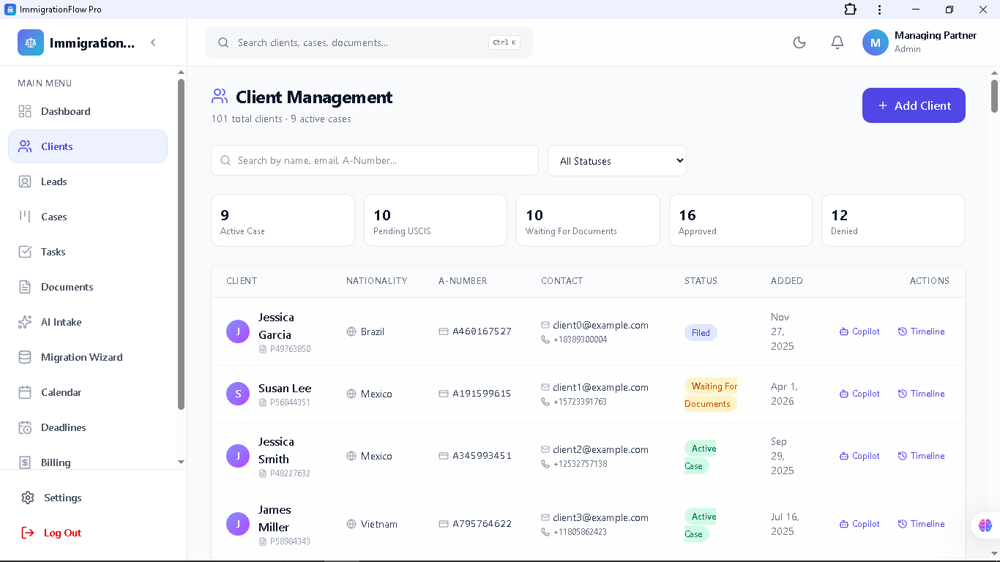
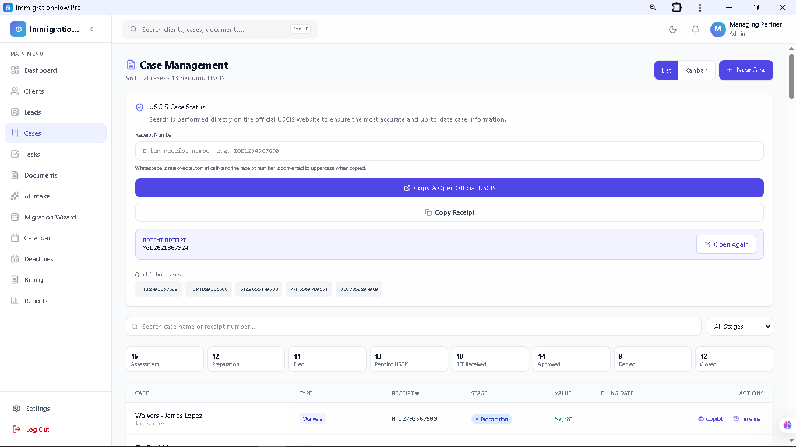
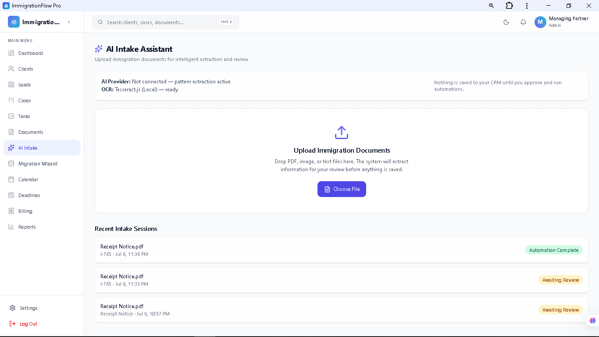
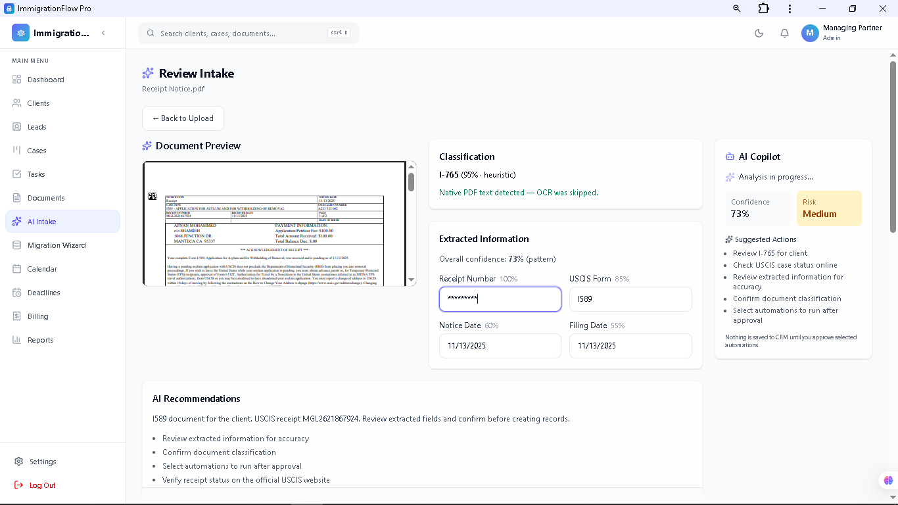
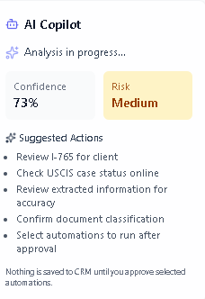
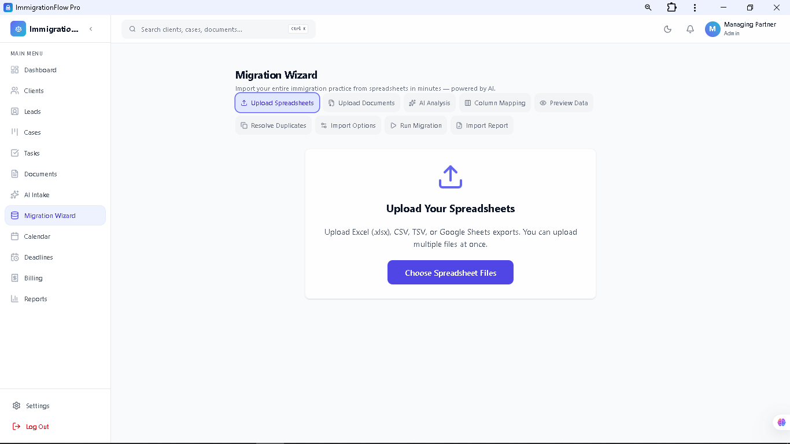
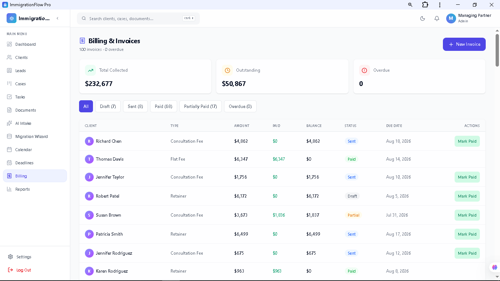
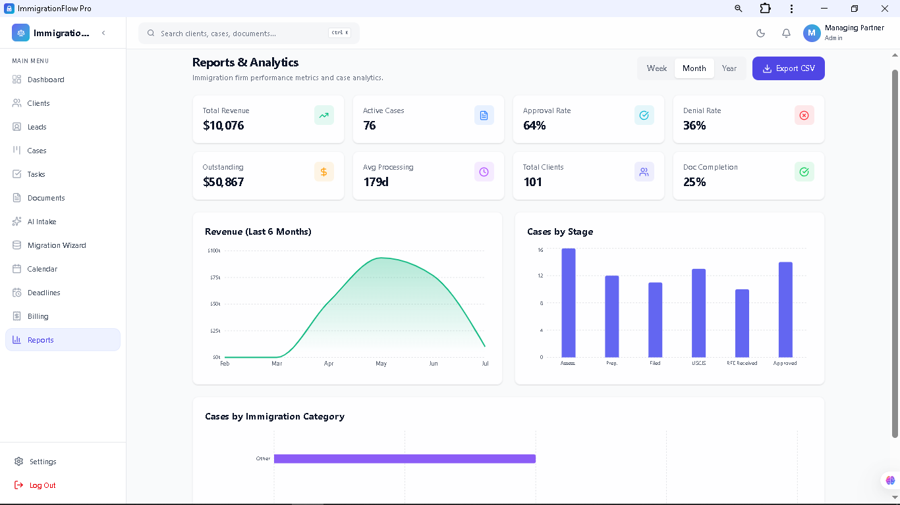
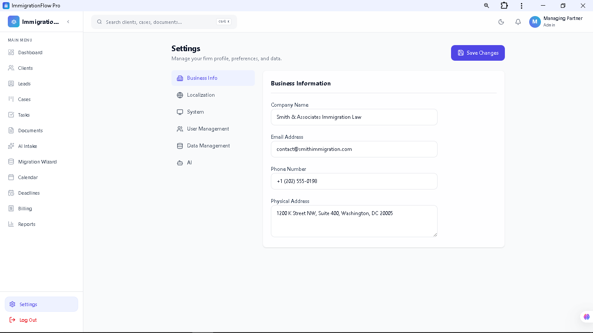

<p align="center">
  
</p>

<p align="center">

[](https://immigration-flow-pro.vercel.app)
[](https://react.dev/)
[](https://www.typescriptlang.org/)
[]
[]
[]
[]

</p>

# ImmigrationFlow AI

## AI-Powered Immigration CRM & Practice Management Platform

ImmigrationFlow AI is a modern SaaS-style Immigration CRM built for immigration law firms, legal consultants, and visa agencies.

It centralizes every aspect of an immigration practice—from leads and clients to cases, documents, AI document analysis, appointments, billing, reporting, and workflow automation—into one intuitive platform.

---

# 🚀 Live Demo

### https://immigration-flow-pro.vercel.app

---

# 📌 Portfolio Demonstration

This deployment is intended for demonstration purposes.

The application showcases a production-oriented architecture and user experience while using local demo data. The architecture is prepared for Firebase Authentication, Firestore, Cloud Storage, and real-world integrations.

---

# ✨ Highlights

- 🤖 AI Document Intelligence
- 📄 OCR Document Processing
- 🧠 Google Gemini Integration
- 💬 AI Case Copilot
- 👥 Client & Lead CRM
- ⚖ Immigration Case Management
- 📅 Calendar & Appointment Scheduling
- ⏰ Deadline Tracking
- 📁 Document Management
- 💳 Billing & Invoicing
- 📊 Executive Dashboards
- 📥 Migration Wizard (Excel / CSV Import)
- 🔍 Global Search
- 🔔 Smart Notifications
- 👤 Role-Based Workspaces
- 📱 Fully Responsive Design
- 🌙 Dark & Light Theme
- 📲 Progressive Web App (PWA)

---

# 🧠 AI Features

ImmigrationFlow AI includes an AI-powered legal assistant designed specifically for immigration workflows.

### AI Intake

- Upload PDFs or Images
- OCR Processing
- Automatic Document Classification
- Intelligent Field Extraction
- Immigration Form Recognition

---

### Document Intelligence

Automatically extracts:

- Client Name
- Email
- Phone Number
- Receipt Number
- A-Number
- Case Type
- Priority Dates
- Interview Dates
- Biometrics
- Deadlines
- Immigration Entities
- Missing Information

---

### AI Copilot

Context-aware assistant capable of:

- Case Summaries
- Risk Analysis
- Missing Documents Detection
- Suggested Next Steps
- Draft Client Emails
- Task Recommendations
- Calendar Recommendations
- Timeline Summaries

---

### Migration Wizard

Import an entire law firm's existing data using:

- Excel
- CSV
- TSV
- Google Sheets Export
- ZIP Document Archives

Automatically creates:

- Clients
- Leads
- Cases
- Tasks
- Documents
- Deadlines
- Calendar Events
- Billing Records

---

# ⚖ Core CRM Features

## Dashboard

- Executive KPIs
- Revenue Overview
- Activity Feed
- Firm Health
- Daily Briefing
- AI Queue
- Case Statistics

---

## Client Management

- Client Profiles
- Contact Information
- Timeline
- Case History
- Notes
- Documents

---

## Immigration Cases

- Case Tracking
- USCIS Quick Access
- Status Pipeline
- Timeline
- Deadlines
- Activities

---

## Leads

- Lead Management
- Conversion to Client
- Assignment
- Status Tracking

---

## Tasks

- Task Management
- Priorities
- Assignments
- Due Dates
- Progress Tracking

---

## Calendar

- Month View
- Week View
- Day View
- Agenda View
- Deadlines
- Appointments
- Case Events

---

## Documents

- Upload
- Download
- Preview
- Categories
- AI Processing
- Version Ready Architecture

---

## Billing

- Invoices
- Payments
- Revenue Dashboard
- Outstanding Balances

---

## Reports

- Revenue Analytics
- Case Analytics
- Client Statistics
- Productivity Metrics

---

# 👥 Role-Based Workspaces

The dashboard automatically adapts based on user role.

Supported workspaces include:

- Managing Partner
- Attorney
- Paralegal
- Legal Assistant
- Intake Specialist
- Receptionist
- Billing
- Office Manager
- Administrator
- Document Specialist
- AI Review Operator

Each workspace displays role-specific widgets, KPIs, shortcuts, notifications, and actions.

---

# 🏗 Architecture

Built using a Clean Architecture approach.

```
Presentation Layer
        │
Application Layer
        │
Domain Layer
        │
Infrastructure Layer
        │
Repository Pattern
        │
Production Ready Backend
(Firebase / Cloud Services)
```

Designed for scalability, maintainability, and future production deployment.

---

# 💻 Technology Stack

| Category | Technologies |
|-----------|--------------|
| Frontend | React 19, TypeScript, Vite |
| UI | Tailwind CSS |
| Charts | Recharts |
| AI | Google Gemini |
| OCR | Tesseract.js |
| PDF | PDF.js |
| Routing | React Router |
| Architecture | Clean Architecture |
| PWA | Service Worker |
| Deployment | Vercel |
| Backend Ready | Firebase |

---

# 📸 Screenshots

> Replace the images below with your own screenshots.

## Login


---

## Dashboard


---

## Clients


---

## Leads


---

## Immigration Cases


---

## Calendar


---

## Tasks


---

## Documents


---

## AI Intake


---

## AI Document Intelligence


---

## AI Case Copilot


---

## Migration Wizard


---

## Billing


---

## Reports


---

## Settings


---


# 💼 Business Value

ImmigrationFlow AI demonstrates how modern AI-assisted software can streamline immigration law firm operations.

The platform reduces repetitive administrative work by combining:

- Practice Management
- AI Assistance
- CRM
- Document Intelligence
- Workflow Automation
- Business Analytics

into a unified experience designed for legal professionals.

---

# 🚀 Production Roadmap

## Completed

- AI Intake
- OCR Pipeline
- Google Gemini Integration
- AI Copilot
- Document Intelligence
- Migration Wizard
- Role-Based Dashboards
- Responsive UI
- PWA
- Calendar
- Billing
- Reporting
- Global Search
- Notification Center

---

## Planned

- Firebase Authentication
- Firestore Database
- Firebase Storage
- Google Calendar Sync
- Gmail / Outlook Integration
- Client Portal
- Multi-Tenant Architecture
- Electronic Signatures
- AI Learning from User Corrections
- Production Deployment

---

# ⚙ Run Locally

```bash
git clone https://github.com/ebroboooo/ImmigrationFlow-Pro.git

cd ImmigrationFlow-Pro

npm install

npm run dev
```

---

# 👨‍💻 Author

**Ebram Sherif**

GitHub:

https://github.com/ebroboooo

---

# ⭐ Support

If you found this project interesting, consider giving it a ⭐ on GitHub.

It helps increase the visibility of the project and supports future development.
