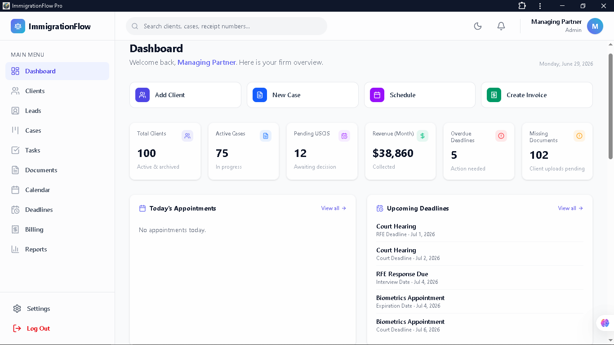
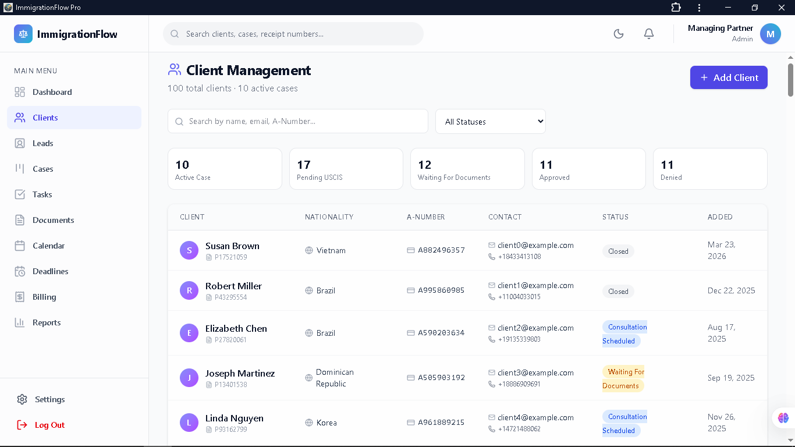
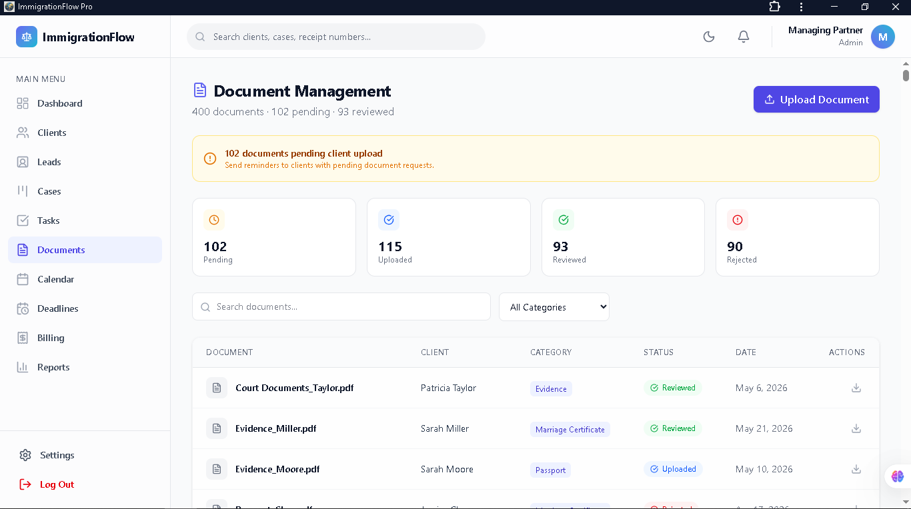
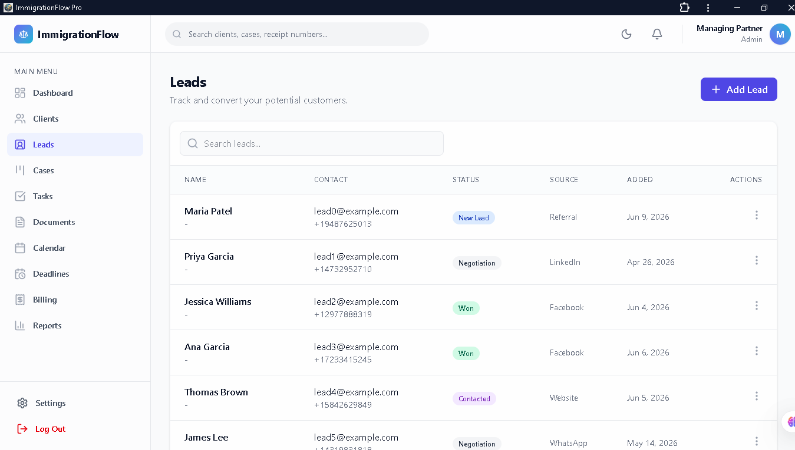
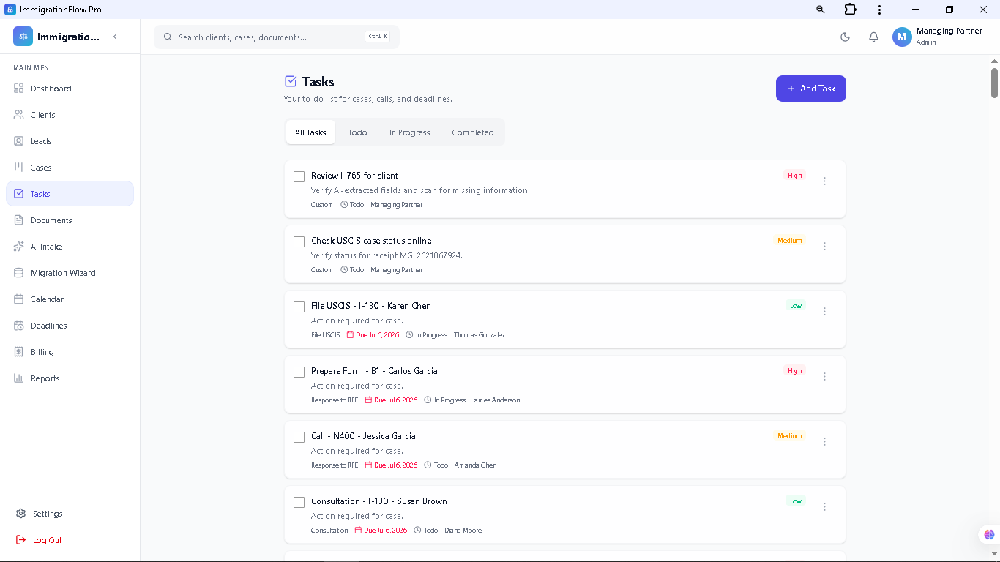

<p align="center">
  
</p>

[](https://immigration-flow-pro.vercel.app)
[](https://react.dev/)
[](https://www.typescriptlang.org/)
[](https://firebase.google.com/)
[](#)

# ImmigrationFlow Pro – Immigration CRM & Practice Management Platform

Modern SaaS-style Immigration Case Management System designed for immigration law firms, visa agencies, and consultants to manage leads, clients, immigration cases, documents, appointments, deadlines, billing, and analytics from a centralized dashboard.

---

## 📖 Overview

ImmigrationFlow Pro is a modern web-based immigration practice management platform built to streamline daily operations for immigration professionals.

The application centralizes client information, immigration cases, documents, appointments, invoices, deadlines, and reporting into a single intuitive dashboard, helping firms improve organization, reduce administrative work, and maintain complete visibility across every stage of the immigration process.

---

## 🚀 Live Demo

**Demo:** https://immigration-flow-pro.vercel.app

---

## 🔓 Portfolio Demonstration

This deployment runs in **Portfolio Demo Mode**.

Authentication has been disabled so recruiters and potential clients can explore the complete application without requiring credentials.

---

## ✨ Features

### 📊 Dashboard & Analytics
- Real-time business dashboard with KPI cards
- Case analytics and reporting
- Revenue overview
- Recent activity feed
- Upcoming appointments and deadlines

### 👥 Client & Case Management
- Client management
- Immigration case tracking
- Kanban case pipeline
- USCIS receipt tracking
- Immigration-specific workflows

### 📄 Document Management
- Client document tracking
- Immigration document categories
- Document status workflow

### 📅 Productivity
- Calendar & appointment scheduling
- Deadline management
- Task management
- Notification center

### 💳 Business Operations
- Billing & invoice tracking
- Revenue reporting
- CSV & JSON data export

### ⚡ Platform Features
- Global search
- Role-based access
- Responsive UI
- Dark / Light mode
- Progressive Web App (PWA)

---

## 🛠 Tech Stack

- React
- TypeScript
- Vite
- Firebase-Ready Architecture
- Tailwind CSS
- Recharts
- React Router
- Vercel

---

## 📸 Screenshots

### 📊 Dashboard


### 👥 Customers


### 📄 Documents


### 🧲 Leads


### ✅ Tasks


---

## 💼 Business Value

ImmigrationFlow Pro demonstrates how modern SaaS applications can simplify immigration practice management by centralizing client records, case tracking, documents, scheduling, billing, and reporting into one organized platform.

The project showcases scalable frontend architecture, responsive design, reusable components, and business-oriented workflows suitable for CRM and case management systems.

---

## 🗺 Roadmap

Future enhancements include:

- AI-assisted case evaluation
- Secure cloud backend
- Email notifications
- Client portal
- Calendar synchronization
- Advanced document automation
- Multi-organization support

---

## 👨‍💻 Author

**Ebram Sherif**

GitHub: https://github.com/ebroboooo

---

## ⚙️ Run Locally

```bash
git clone https://github.com/ebroboooo/ImmigrationFlow-Pro.git

cd ImmigrationFlow-Pro

npm install

npm run dev
```
